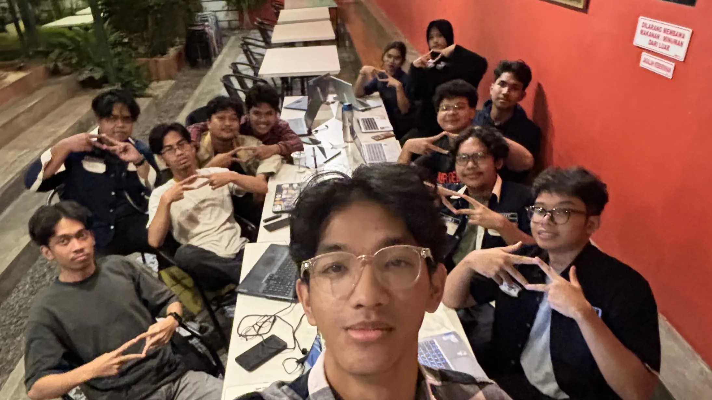

For the past year, I led development of the HMDTIF (Himpunan Mahasiswa Departemen Teknik Informatika) website for the Gelora Sancaka cabinet. You can check it out at [hmdtif-filkom.ub.ac.id](https://hmdtif-filkom.ub.ac.id) or follow us on Instagram [@hmdtif.filkomub](https://instagram.com/hmdtif.filkomub). We built a platform to replace Google Forms, Linktree, and Bitly with our own tools. The technical part worked out. Getting people to actually use it? That's where things got complicated.

## Why I Did This

Before I talk about the project, I should explain why I wanted to be BPH PIT in the first place.

The previous HMDTIF cabinet trusted me to be BPH at Intrivia, one of their events. I learned so much from that experience - not just about event management, but about how HMDTIF operates, what the organization needs, and what it means to actually serve the department.

I wanted to give back. The previous cabinet gave me an opportunity to contribute, and I felt like I owed it to HMDTIF to do the same. So when the chance came to be BPH PIT for Gelora Sancaka, I took it. I wanted to build something that would actually help the department, make processes easier, and hopefully make a difference.

Turns out giving back is harder than I thought.

## The Challenge

The department had a few pain points with how we ran things:

**Google Forms couldn't validate properly.** We used gforms for recruitment, but it only checks email. We needed to validate based on major (Teknik Informatika or Teknik Komputer) and batch year to make sure only eligible students could apply. With gforms, anyone could submit and we had to filter manually.

**Announcement process looked unprofessional.** When we sent acceptance/rejection emails, it was plain text. Looked pretty bad. We wanted HTML formatted emails that actually looked official.

**Linktree and Bitly weren't ours.** Using third party services for our official links felt unprofessional. We wanted our own short links and link hub under our domain.

**Paper based piket attendance.** Secretariat attendance was still pen and paper. Easy to fake, hard to track.

So we decided to build our own platform that could handle all of this.

## My Role

I was technical lead and project manager for this, which honestly meant doing most of the technical work myself while also trying to manage 11 people.

On the technical side, I designed the architecture, made all the key decisions, built most of the complex features, did code reviews, and handled deployments. On the PM side, I broke down features into tasks, assigned them, tried to manage timelines.

The hardest part wasn't balancing roles. The hardest part was my inability to build a team structure that worked. I struggled to delegate effectively and create an environment where people could learn and contribute at their own pace. I was also busy with other projects at the same time, so I couldn't give this the attention it needed.

But the most frustrating thing? After we built all this, our own organization didn't really use it. People kept using Google Forms and Linktree because that's what they were comfortable with. We even tried making feedback forms to understand what users needed, but nobody filled them out. So we didn't know if the features we were building were actually good, needed, or useful.

## What We Built

With a team of 12 people (including me) over 12 months (January-December 2025), we shipped:

### 1. **Alpha Web: Dynamic Form Builder**
This was the first feature we built. Department needed it for open recruitment, so that's why we started here.

What we built:
- Landing page with information about the Teknik Informatika department
- SIAM OAuth integration (university single sign-on)
- Dynamic form builder where you can create different types of forms, open recruitment was just the first use case
- Form validation by batch year and major (the key thing gforms couldn't do)
- User management with different roles based on department and position
- Automated email notifications for acceptance/rejection with HTML formatting
- Data export and basic metrics

OAuth was built first because recruitment needed it, then other features could use the same login system.

### 2. **Piket Attendance**
Digitized the paper-based secretariat attendance.

Key features:
- Scheduling system (secretariat manages who's on duty)
- Real-time photo capture via webcam (photos taken in browser, not uploaded)
- GPS validation with 10-meter radius (can only check in if you're actually at secretariat)
- 14-day photo retention (auto cleanup to save storage)
- Dashboard to monitor attendance

GPS and photo requirements were there to prevent people from faking attendance from home.

### 3. **URL Shortener**
Built our own link shortener so we could have custom URLs under our domain instead of using Bitly.

Features:
- Custom short URLs (like hmdtif-filkom.ub.ac.id/l/echo-advo)
- Expiry dates for time-sensitive links
- QR code generation for posters
- Click analytics
- Rate limiting to prevent abuse

Built with Go because we needed to handle lots of concurrent redirects, especially during big events.

### 4. **LinkHub**
Our own Linktree. We made it single-page only (one official page for the whole department) instead of letting everyone make their own pages, which would have been a mess to manage.

Features:
- Public link page (hmdtif-filkom.ub.ac.id/link-hubs)
- Add, edit, reorder links via drag and drop
- Click analytics
- View count tracking

### 5. **Company Profile**
Landing page about the Gelora Sancaka cabinet at [hmdtif-filkom.ub.ac.id](https://hmdtif-filkom.ub.ac.id). Shows details of the 5 departments, who the staff are and what they do, cabinet logo with its philosophy, vision and mission, and information about the leadership. This is important because people don't really understand what each department does or who's responsible for what.

### 6. **News & Announcements**
CMS for publishing department news and updates. Built this but haven't deployed it yet.

Features:
- List and detail views for articles
- CRUD operations (title, body, image, publish date, article type)
- View statistics

The idea is to make searching for information easier. Instagram and WhatsApp are pretty messy for finding old announcements. This centralizes info (not replacing those platforms, just making things easier to find).

### 7. **Work Program Database**
System for managing Gelora Sancaka's work programs. Also built but not deployed yet.

Features:
- List and detail views
- Monthly calendar view showing program timelines
- CRUD operations (description, logo, links, important dates, documentation)
- View statistics

The calendar view would be useful for leadership to see what's happening each month and spot scheduling conflicts.

### 8. **Audit Log**
Logs every action (create/update/delete) in the system. This is for organizational leadership to track accountability, not public facing.

Features:
- Read-only logs (can't be deleted or modified)
- Automatic logging for all operations
- Track who did what and when
- Filter by person, action type, date
- Archive after 12 months (logs grow indefinitely otherwise)

When something breaks or someone asks "who changed this?", we can trace it.

### 9. **File Service**
Shared backend service for handling file uploads across all features. Prevents duplicate logic and security issues.

Features:
- File upload with validation (type, size limits)
- Private by default (only accessible via authenticated endpoints)
- Bucket-based storage (profile photos, attendance photos, news images, work program logos all go to different buckets)
- Soft delete (retain for 30 days before actual deletion)

Every feature that needs file uploads uses this service instead of implementing its own upload logic.

## Tech Stack

**Frontend: Next.js**

Used Next.js for the frontend because it has SSR (server side rendering) which is better than pure client side rendering for SEO and initial load times. Also has server actions which we used to call the Go backend APIs.

Main trade-off was the team needed to understand the difference between client and server components.

**Backend: Go**

All backend services are written in Go. Chose Go because it handles concurrent requests well (important for URL shortener during big events) and compiled binaries are easy to deploy.

Main issue was that the team members had no backend experience before this, so there was a learning curve.

**Database: PostgreSQL**

Used Postgres for relational data. We used sqlx library (not an ORM) to interact with the database from Go.

**File Storage: S3-compatible object storage**

Files go to object storage instead of database for better performance. Has lifecycle policies for automatic deletion (needed for the 14-day photo retention).

**Repository Structure**

Backend and frontend are in separate repos, not a monorepo.

## The Reality of Managing the Project

Honestly, I struggled to manage 11 people effectively. My approach was to just do the technical work myself instead of properly mentoring and delegating. That was a failure on my part as a leader.

I tried to delegate tasks and do proper planning with task breakdowns and all that, but it didn't work as smoothly as I hoped. When people got stuck, instead of taking time to teach or guide them through it, I'd just take over to keep things moving. I was also juggling other projects at the same time which made it harder to focus on being a good mentor.

And the feedback problem was real. We had no idea if what we were building was actually useful or needed. Tried making forms to get user feedback, but nobody filled them out. So we just kept building features without really knowing if they were solving real problems or not.

We did write RFCs (Request for Comments) for each major feature before building it, which helped a lot. At least when someone asked "why did we do it this way?" we had documentation to point to.

## What Made This Hard

### 1. Time Management
I was juggling this project with other commitments, which meant I couldn't invest enough time in mentoring. When people got stuck, I'd often just end up doing it myself because I thought waiting for them to figure it out would take too long. Not ideal, but I prioritized deadlines over teaching.

Looking back, I should've invested that time in teaching instead of just doing it myself. That would've been better for everyone in the long run.

### 2. Low Team Motivation
Honestly, I failed to create an environment where people felt invested in what we were building. I couldn't communicate the vision clearly enough or give people ownership over meaningful parts of the project. When people showed up to meetings but didn't put in effort, that was a sign I wasn't leading well.

This was my failure as a leader. I couldn't inspire people or give them reasons to care about what we were building.

### 3. Features Not Being Used
The most frustrating part was building all this stuff and then watching people continue using Google Forms and Linktree. We put in months of work and people just... didn't switch over. They were comfortable with the old tools and didn't want to learn something new, even if it was better.

### 4. No Feedback Loop
We had no way to know if we were building the right things. Tried making feedback forms, but nobody filled them out. So we were basically guessing at what features would be useful. Built some things that probably nobody needed, but we wouldn't know until after spending weeks on them.

## What We Ended Up With

After 12 months, we have a platform that's technically working. It's built for the DTIF department, replaces some external tools (Google Forms, Linktree, Bitly), digitizes piket attendance, and has a bunch of features for managing work programs and tracking changes.

Some of it's deployed, some of it isn't yet. The code works, but the adoption problem is still there. People are still using the old tools because that's what they're used to.

On the positive side, the team did learn some things. People who didn't know backend development before at least got exposed to it. We have documentation (RFCs) that explains why things work the way they do.

But honestly, the main outcome is that we have a platform that could be useful if people actually used it.

## About the Team

The team showed up and tried. That's worth mentioning. 11 people working on something for a year is no joke, even when I wasn't giving them the leadership and support they needed.

I appreciate the effort people put in, even if the results weren't what we wanted. Some people learned new tech, some people stuck with it even when things were slow. That counts for something.

## What I Actually Learned

### 1. Building it doesn't mean people will use it
This is probably the biggest lesson. You can build the best platform in the world, but if you don't think about adoption from day 1, it doesn't matter. People are comfortable with what they know, and getting them to switch is way harder than the technical work.

### 2. You can't lead a team by doing all the work yourself
I thought the solution to challenges was to just do the work myself. Wrong. That doesn't help anyone grow, and it turns you into a bottleneck. A better leader would've invested time in mentoring, pair programming, and creating a learning environment instead of just taking over. When you do everything yourself, you're not leading - you're just working alone with witnesses.

### 3. Creating ownership matters more than technical execution
When people don't feel ownership over what they're building, they won't be invested. I failed to give people meaningful ownership. I was too controlling about decisions and too quick to take over when things moved slowly. That's on me, not them. People need to feel like they're building something, not just executing someone else's vision.

### 4. Political/organizational stuff is harder than technical problems
The code was the easy part honestly. The hard part was getting people to care, getting feedback, dealing with low motivation, and trying to get the organization to actually adopt what we built. Technical challenges you can Google. Organizational challenges? Good luck.

### 5. Documentation actually helps
One thing that did work: writing RFCs before building features. When someone asked "why did we do this?", we could point to the RFC instead of explaining it again. Documentation saves time, even if it feels like a waste while you're writing it.

## To My Team - An Apology and Thank You

I owe you all an apology.

I know I was too controlling sometimes. It probably made you feel like you couldn't make decisions without me. I was too idealistic about what we could build and how fast we could do it. I pushed features that weren't even clear or well-defined yet, and when things got stuck, I'd just take over easily instead of helping you work through it.

I was also too nice sometimes. When I should've pushed harder or been more direct about things not working, I just let it slide because I didn't want to deal with conflict or make anyone feel bad.

That wasn't fair to you. You deserved a better lead who could actually balance between guiding and trusting, between pushing and supporting. Someone who could teach instead of just taking over.

But I also want to say thank you.

Thank you for trusting me to lead this project. For showing up to meetings even when you were busy or tired. For sticking around even when the work was slow and frustrating and nobody seemed to care about what we were building. For putting in effort even when you knew I was probably going to rewrite half of it anyway.

You showed me love and support even when I didn't deserve it. Even when I was being difficult or demanding or just generally not a great lead.

This will be a moment I will never forget. The year we spent building this together, the late nights debugging, the meetings where we tried to figure out why nothing was working, the small wins when something finally deployed. All of it.

*Here's us - 12 people who spent a year building something together.*

## To the Next PIT Team

The platform exists now. Don't rebuild it from scratch, please. Just improve what's there.

Your main challenge isn't going to be technical. It's going to be getting people to actually use what we built. Here's what I'd focus on if I were you:

**1. Push for actual adoption**

Talk to people. Figure out why they're still using Google Forms and Linktree. Is it a UX problem? Is it a communication problem? Fix those first before adding new features. A working platform that nobody uses is worse than no platform at all.

**2. Get feedback before building anything new**

We built some features that probably nobody needed because we had no feedback loop. Don't make that mistake. Talk to users, understand their actual needs, then build. Not the other way around.

**3. Keep improving what exists**

There's a backlog of V2 features (tagging for news, RSVP for work programs, mobile app, etc.). But validate those are actually needed first. Maybe people just need the existing features to work better.

**4. Fix the adoption problem**

This is the real work. The code mostly works. Getting the organization to change their habits is what matters now.

The platform is there. Make people actually want to use it. That's the challenge I couldn't solve, maybe you can.

---

*(This is my personal reflection on leadership challenges. Every team member brought value to this project, and any shortcomings in execution reflect on my leadership, not their abilities.)*

> Building HMDTIF taught me more about organizational dynamics than technical architecture. The code works, but getting people to change their habits is the real challenge. Hope you do better with the adoption problem than I did.

---

**Check out the platform**: [hmdtif-filkom.ub.ac.id](https://hmdtif-filkom.ub.ac.id)

**Follow HMDTIF**: [@hmdtif.filkomub](https://instagram.com/hmdtif.filkomub)

{
  

    yeah i wrote this with claude code's help but every word about what went wrong, what i learned, and how i failed as a leader - that's all me. the regret is real, the appreciation for the team is real, the frustration with adoption is real. claude helped me organize my thoughts and make it less harsh on the team, but the feelings? those are 100% mine.
  

}
